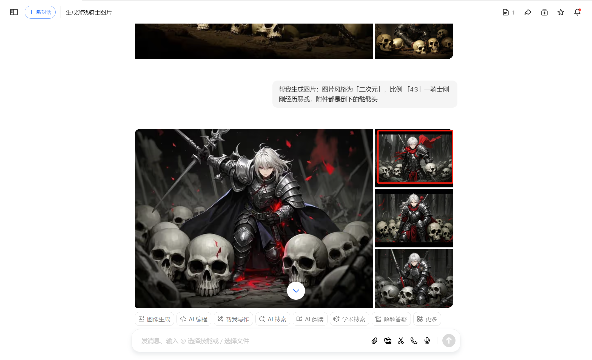

# Arte

## Música y efectos de sonido (BGM)

Música seleccionada de la plataforma:  
[Musica o BGM](https://www.aigei.com/sound/class/games_category)

Los sonidos han sido seleccionados intentando que encajen con el contexto de la historia y la acción del jugador. Por ejemplo, el sonido de la muerte transmite un grito prolongado.

## Texturas

Recursos visuales descargados de:  
[Textura](https://www.zhaozi.cn/s/all/otf/)

La textura elegida es la que visualmente resulta menos cuadrada y más cómoda a la vista.

## Personajes enemigos

Personaje esqueleto obtenido desde:  
[Personaje Esqueleto](https://www.aigei.com/s?q=%E9%AA%B7%E9%AB%85%E5%85%B5&type=2d)

Se ha seleccionado para mantener coherencia con la historia predefinida.

## Otros recursos

Para completar la ambientación, se han utilizado recursos adicionales de:

- [itch.io](https://itch.io/)
- [craftpix.net](https://craftpix.net/)

Recursos del archivo del aula virtual:

- Moneda (recurso que en el futuro podría utilizarse para implementar una tienda de objetos, herramientas o equipamiento).

## Generación de fondo mediante IA

La imagen de fondo principal fue generada con inteligencia artificial.

