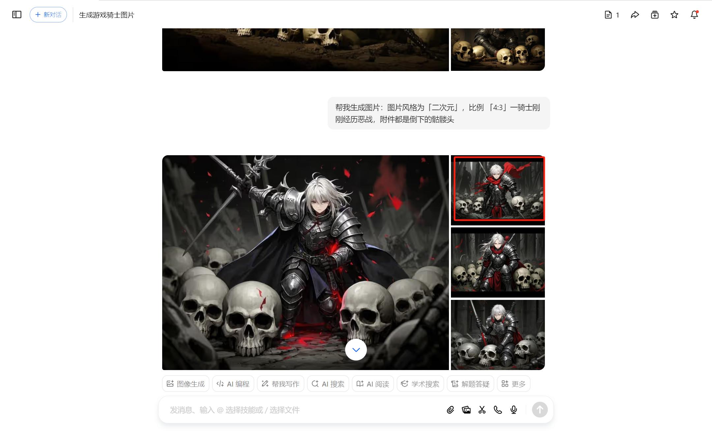

# Arte

## Música y efectos de sonido (BGM)

La música ha sido seleccionada desde la siguiente plataforma:  
[Musica o BGM](https://www.aigei.com/sound/class/games_category)

Los sonidos han sido elegidos intentando que encajen con el contexto de la historia y la acción del jugador.  
Por ejemplo, el sonido de la muerte transmite un grito prolongado que refuerza la sensación de impacto y dramatismo.

## Texturas

Recursos visuales descargados de:  
[Textura](https://www.zhaozi.cn/s/all/otf/)

La textura elegida es la que visualmente resulta menos cuadrada y más cómoda a la vista, adaptándose mejor al estilo artístico del juego.

## Personajes enemigos

El personaje esqueleto fue obtenido desde:  
[Personaje Esqueleto](https://www.aigei.com/s?q=%E9%AA%B7%E9%AB%85%E5%85%B5&type=2d)

Se ha seleccionado para mantener coherencia con la historia predefinida y la ambientación medieval fantástica.

## Otros recursos

Para completar la ambientación, se han utilizado recursos adicionales de:

- [itch.io](https://itch.io/)
- [craftpix.net](https://craftpix.net/)
- [freepik.es](https://www.freepik.es/)

## Generación de fondo mediante IA

La imagen de fondo principal fue generada mediante inteligencia artificial, buscando una ambientación acorde con el tono del juego.

