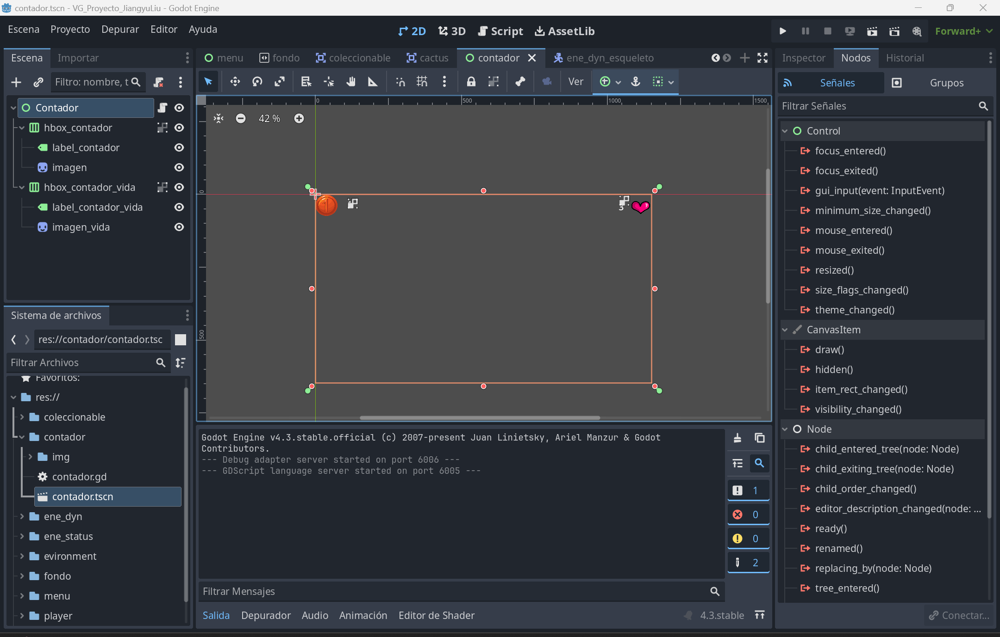
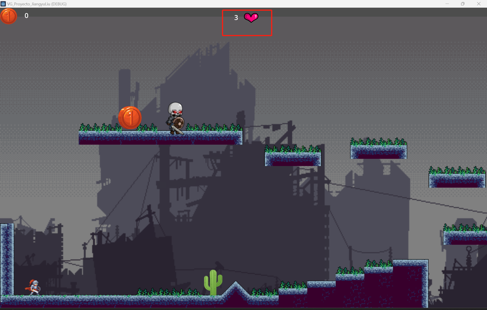

# Problemas

## Dificultades con los cactus y la vida

A la hora de seguir los pasos de los apuntes, cuando llegué a la parte de los cactus y la vida, me costó bastante resolver el problema.

En ese apartado pensé que mostrar la moneda era lo mismo que mostrar la vida, por lo tanto lo hice en la misma escena.

En el script hice algo similar. Sin embargo, a la hora de hacer la relación con el jugador me resultó complicado, porque los métodos estaban en inglés y, como no se me da muy bien, me costó entenderlos y saber cómo hacer las referencias correctamente.

Después de investigar y traducir varias partes, conseguí comprenderlo mejor y solucionarlo.

Al agrandar la pantalla, el corazón que representa la vida no se ajustaba correctamente y no conseguía descubrir cómo solucionarlo.

Más tarde entendí el motivo: el recuadro visible corresponde a la vista de la pantalla y la configuración de la vista no estaba correctamente ajustada.

Para que se vea correctamente, moví todos los elementos hacia la izquierda para que quedaran dentro del área visible.
